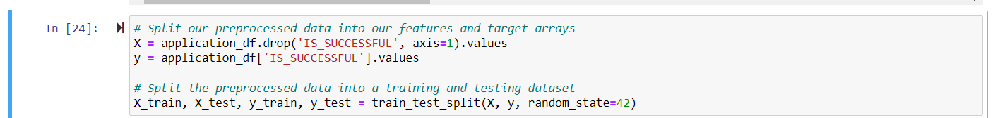

# deep-learning-challenge
 
#Overview

    The purpose of this analysis was to develop a model to assist a non-profit foundation called Alphabet Soup as a tool to enable them to determine which applicants should recieve funding from them based on having the highest chance of success in their ventures. This model was based on the basis of historical data that was recieved of 34,000 organizations that recieved funding from this organization with metadata about each organization who recieved funding.

#Results

    The following were the results:

    ##Data Preprocessing:

        [What variable(s) are the target(s) for your model?]

            The variable that was the target for the model was "IS_SUCCESSFUL," and was generated around predicting this value.

            

        [What variable(s) are the feature(s) for your model?]
    
            The features of the model are the following variables: 'APPLICATION_tYPE','AFFILIATION', 'CLASSIFICATION', 'USE_CASE', 'ORGANIZATION', 'STATUS', 'INCOME_AMT', 'SPECIAL_CONSIDERATIONS, 'ASK_AMT', 'IS_SUCCESSFUL'

                Index(['EIN', 'NAME', 'APPLICATION_TYPE', 'AFFILIATION', 'CLASSIFICATION',
                'USE_CASE', 'ORGANIZATION', 'STATUS', 'INCOME_AMT',
                'SPECIAL_CONSIDERATIONS', 'ASK_AMT', 'IS_SUCCESSFUL'],
                dtype='object')

        [What variable(s) should be removed from the input data because they are neither targets nor features?]
    
            The two variables removed from the input data were 'NAME' and 'EIN'.

    ##Compiling, Training, and Evalauating the Model:
        
        [How many neurons, layers, and activation functions did you select for your neural network model, and why?]
    
            Three layers total were used for the model based on the number of features.

        [Were you able to achieve the target model performance?]

            Target model performance of 75% target predictive accuracy was not acheived by any of the attempts made however did some were close at approximately 70%.
        
        [What steps did you take in your attempts to increase model performance?]

            Multiple attempts were made at increasing model performance as follows:
                [The number of epochs was both increased and decreased]
                [The cutoff value for binning the 'CLASSIFICATION' and 'APPLICATION_TYPE' features were decreased]
                [Additional features were attepted to be dropped from the dataset ('SPECIAL_CONSIDERATIONS')]

    ##Summary

        The overall results of the various attempts at improving model prediction accuracy ranged between approximately 59% - 70% accuracy. Through using various methods such as tree based modeling or Random Forest Classification there may be a better understanding developed of the data to assist in generating a better model with higher accuracy.

            Model: "sequential" 
_________________________________________________________________
 Layer (type)                Output Shape              Param #   
=================================================================
 dense (Dense)               (None, 80)                4000      
                                                                 
 dense_1 (Dense)             (None, 30)                2430      
                                                                 
 dense_2 (Dense)             (None, 1)                 31        
                                                                 
=================================================================
Total params: 6461 (25.24 KB)
Trainable params: 6461 (25.24 KB)
Non-trainable params: 0 (0.00 Byte)
_________________________________________________________________

    